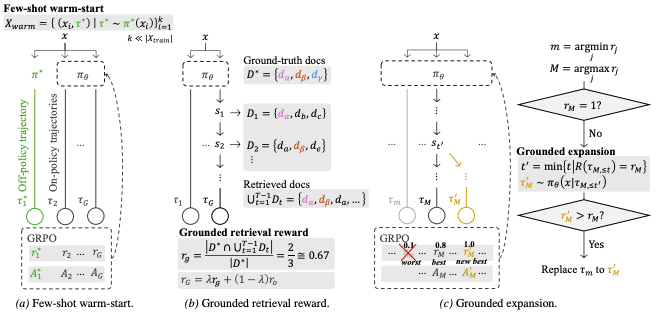

<<<<<<< HEAD
# DAVID-GRPO

DAVID-GRPO is a **budget-efficient reinforcement learning framework** that enables **small language model agents** to perform **grounded multi-hop reasoning** under strict compute constraints.

Contrary to the common belief that multi-hop reasoning requires large models and massive rollouts, DAVID-GRPO demonstrates that **with the right inductive biases**, small agents can achieve **high accuracy at low training cost**.

This repository provides the official implementation of DAVID-GRPO.

---

## 🚀 Key Idea

Existing RL-based reasoning agents work well only in **high-cost, high-accuracy regimes**, relying on:
- large models,
- massive rollout budgets,
- dense on-policy exploration.

Under realistic resource constraints, small agents suffer from:
1. **Cold-start instability**
2. **Sparse and delayed rewards**
3. **Inefficient exploration**

DAVID-GRPO addresses all three issues **simultaneously** with a simple but effective design.

---

## 🧠 Core Components

### 1. Few-Shot Warm-Start (Cold-Start Stabilization)
- Uses **only a handful of expert trajectories** (e.g., 4 examples)
- Combines **off-policy expert trajectories** with **on-policy rollouts**
- Prevents early policy collapse without large-scale supervision

### 2. Grounded Retrieval Reward (Dense Credit Assignment)
- Rewards **evidence recall**, not just final answer correctness
- Computes recall over the **union of retrieved documents** across all steps
- Encourages faithful multi-hop retrieval instead of parametric shortcuts

### 3. Grounded Expansion (Efficient Exploration)
- Identifies **near-miss trajectories**
- Truncates at the last grounded step and **resamples continuations**
- Improves sample efficiency without additional full rollouts

---

## 🧪 Experimental Highlights

- Trained on **4× RTX 3090 GPUs**
- Models up to **1.5B parameters**
- Uses only **~4.7% of the rollout budget** of high-cost baselines
- Consistently outperforms prior RL methods on **6 multi-hop QA benchmarks**

Benchmarks include:
- HotpotQA
- 2WikiMultiHopQA
- MuSiQue
- Bamboogle / BamTwoogle
- AntiLeakBench (multi-hop)

---

## 📊 Why DAVID-GRPO Works

DAVID-GRPO reinterprets RL failures in low-budget settings through the lens of **information retrieval**:

| RL Problem | IR Analogy | DAVID-GRPO Solution |
|-----------|-----------|--------------------|
| Cold-start | Zero-shot retrieval | Pseudo-positive warm-start |
| Sparse rewards | Relevance judgments | Grounded retrieval reward |
| Poor exploration | Bounded recall | Adaptive grounded expansion |

This alignment leads to **stable training**, **faithful retrieval**, and **robust multi-hop reasoning**.

---

## 🛠️ Repository Structure (Planned)

```text
david-grpo/
├── grpo/                 # GRPO and mixed off-/on-policy training
├── rewards/              # Grounded retrieval reward
├── expansion/            # Grounded expansion module
├── retriever/            # FAISS + dense retriever setup
├── prompts/              # Agent prompts
├── experiments/          # Training & evaluation scripts
├── configs/              # Hyperparameter configs
└── README.md

## License
This project is licensed under the Apache License 2.0.
=======
<div align="center">
  
</div>
<h1 align="center" style="margin-top: 10px;">Can David Beat Goliath? On Multi-Hop Reasoning with Resource-Constrained Agents</h1>

<p align="center">
  Hojae Han<sup>1</sup>,
  Heeyun Jung<sup>2</sup>,
  Jongyoon Kim<sup>3</sup>,
  Seung-won Hwang<sup>3*</sup>
  <br>
  <sup>1</sup>ETRI &nbsp;&nbsp;
  <sup>2</sup>HKU &nbsp;&nbsp;
  <sup>3</sup>SNU
  <br>
  <sup>*</sup>Corresponding author
</p>

<div align="center">

[](https://arxiv.org/abs/2601.21699)
[](https://arxiv.org/pdf/2601.21699)

</div>

## News
- [Jan 30, 2026]: Codebase prepared for release.

## Table of Contents
- [Overview](#overview)
- [Quick Start](#quick-start)
- [Training](#training)
- [Evaluation](#evaluation)
- [Acknowledgements](#acknowledgements)
- [Citation](#citation)
- [License](#license)

## Overview
DAVID-GRPO enables **multi-hop reasoning under tight compute budgets** by reinterpreting RL failures as a **cold-start retrieval** problem and adapting classic IR principles. The method combines:
- **Few-shot warm-start** (mixed off-/on-policy GRPO)
- **Grounded retrieval reward** (evidence recall across the full trajectory)
- **Grounded expansion** (resampling truncated near-miss trajectories)

<p align="center">
  
  <i>
  Figure 2. Overview of DAVID-GRPO.
  </i>
</p>

## Quick Start
Set your repo root once:
```bash
export REPO_ROOT=/path/to/David-GRPO
```

### RL Environment (verl)
```bash
conda create -n david-grpo python=3.10 -y
conda activate david-grpo
pip install -r ${REPO_ROOT}/requirements.txt
```

### HotpotQA Retriever (training)
```bash
conda create -n hotpot-retriever python=3.10 -y
conda activate hotpot-retriever
pip install -r ${REPO_ROOT}/hotpotqa_retriever/requirements.txt
```
Build the HotpotQA corpus (AutoCoA-compatible) from train+dev JSONL:
```bash
python ${REPO_ROOT}/hotpotqa_retriever/build_hotpotqa_corpus.py \
  --train /path/to/hotpotqa_train.jsonl \
  --dev /path/to/hotpotqa_dev.jsonl \
  --output ${REPO_ROOT}/hotpotqa_retriever/hotpotqa_corpus.json
```
Then create the FAISS index:
```bash
python ${REPO_ROOT}/hotpotqa_retriever/create_faiss_index.py
```
Launch:
```bash
conda activate hotpot-retriever
python ${REPO_ROOT}/hotpotqa_retriever/run_server.py --port 8001
```
`train.sh` expects `RETRIEVER_URL=http://localhost:8001/retrieve`.

### Eval Retriever (wiki-18 / wiki-24)
```bash
conda create -n eval-retriever python=3.10 -y
conda activate eval-retriever
pip install -r ${REPO_ROOT}/eval_retriever/requirements.txt
```

#### Prepare wiki-18 (public, prebuilt index)
```bash
${REPO_ROOT}/eval_retriever/scripts/prepare_wiki18.sh
```
Creates:
```
${REPO_ROOT}/data/wiki/e5_Flat.index
${REPO_ROOT}/data/wiki/wiki-18.jsonl
```

#### Prepare wiki-24 (your own dump)
1) Place your JSONL:
```
${REPO_ROOT}/data/wiki-24/wiki-24.jsonl
```
2) Build FAISS index:
```bash
python ${REPO_ROOT}/eval_retriever/scripts/build_faiss_index.py \
  --corpus ${REPO_ROOT}/data/wiki-24/wiki-24.jsonl \
  --output ${REPO_ROOT}/data/wiki-24/index/e5_Flat.index \
  --model intfloat/e5-base-v2 \
  --batch-size 256
```

#### Launch eval retrievers
```bash
# wiki-18 (standard eval)
${REPO_ROOT}/eval_retriever/local_retrieval_launch.sh

# wiki-24 (AntiLeakBench)
${REPO_ROOT}/eval_retriever/local_retrieval_launch_wiki24.sh
```
Set `RETRIEVER_URL` accordingly:
- wiki-18: `http://localhost:8003/retrieve`
- wiki-24: `http://localhost:8004/retrieve`

## Training
Main training script:
```bash
${REPO_ROOT}/scripts/train.sh
```
Notes:
- Set `WARMUP_CHECKPOINT_PATH` to your warmup checkpoint.
- Ensure the HotpotQA retriever is running on port 8001.

## Evaluation
The generation script expects the eval retriever on 8003 (wiki-18) or 8004 (wiki-24):
```bash
${REPO_ROOT}/scripts/eval/generate_response.sh
```

## Acknowledgements
- Codebase derived from AutoCoA and Search-R1.
- Reinforcement learning pipeline uses the **verl** framework.

References:
- https://github.com/ADaM-BJTU/AutoCoA
- https://github.com/PeterGriffinJin/Search-R1
- https://github.com/verl-project/verl

## Citation
```bibtex
@article{han2026davidgrpo,
  title={Can David Beat Goliath? On Multi-Hop Reasoning with Resource-Constrained Agents},
  author={Hojae Han and Heeyun Jung and Jongyoon Kim and Seung-won Hwang},
  journal={arXiv preprint arXiv:2601.21699},
  year={2026}
}
```

## License
This project is licensed under the Apache-2.0 License. See `LICENSE` for details.
>>>>>>> 0165a2c (Initial release)
