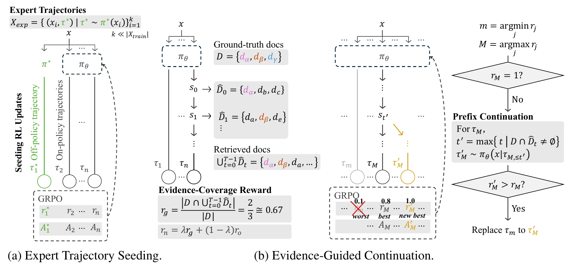
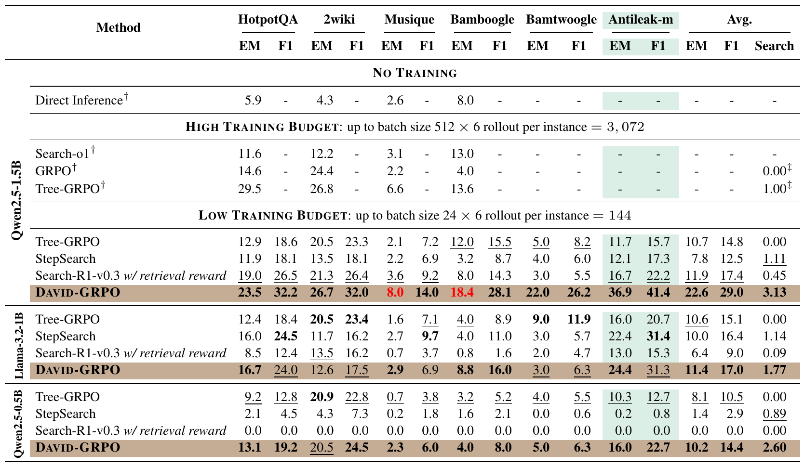

<div align="center">
  
</div>
<h1 align="center" style="margin-top: 10px;">Can David Beat Goliath? On Multi-Hop Reasoning with Resource-Constrained Agents</h1>

<p align="center">
  Anonymous code release for double-blind review.
</p>

## News

- [Sep 26, 2026]: Updated the method overview, main results, original synthetic data, and corrected training implementation.

## Table of Contents

- [Overview](#overview)
- [Results](#results)
- [Quick Start](#quick-start)
- [Training](#training)
- [Original synthetic data](data/synthetic/README.md)
- [Training implementation](docs/training.md)
- [Evaluation](#evaluation)
- [Acknowledgements](#acknowledgements)
- [Citation](#citation)
- [License](#license)

## Overview

DAVID-GRPO trains multi-hop retrieval agents under tight compute budgets. It combines:

- **Expert Trajectory Seeding:** a few expert trajectories are mixed with on-policy rollouts during the initial RL updates.
- **Evidence-Guided Continuation:** an evidence-coverage reward guides the selection of promising prefixes for continuation and trajectory replacement.

The current main results use automatically constructed training instances with their associated supporting documents. The annotated-evidence (gold) variant is reported separately in the paper. These training settings use different data and retrieval corpora; they are not interchangeable.

<p align="center">
  
  <br>
  <em>Figure 2. Overview of DAVID-GRPO.</em>
</p>

## Results

Main performance table from the current manuscript (September 26, 2026). Numbers are Exact Match (EM) / F1 in percent. Search is the mean number of search actions per question over the six benchmarks. Dashes indicate unreported values; † denotes results reported by Ji et al. (2026), and ‡ denotes the final valid-search count per rollout in their released training logs. Teal AntiLeak-m cells mark questions after the backbone's knowledge cutoff. The Ours rows here use constructed training data, not the gold-annotation ablation.

<p align="center">
  
  <br>
  <em>Overall performance comparison on six multi-hop QA benchmarks.</em>
</p>

## Quick Start
Set your repo root once:
```bash
export REPO_ROOT=/path/to/David-GRPO
cd "${REPO_ROOT}"
```

### RL Environment (verl)
```bash
conda create -n david-grpo python=3.10 -y
conda activate david-grpo
pip install -r ${REPO_ROOT}/requirements.txt
```

### HotpotQA Retriever (training)
```bash
conda create -n hotpot-retriever python=3.10 -y
conda activate hotpot-retriever
pip install -r ${REPO_ROOT}/hotpotqa_retriever/requirements.txt
```
Build the HotpotQA corpus (AutoCoA-compatible) from train+dev JSONL:
```bash
python ${REPO_ROOT}/hotpotqa_retriever/build_hotpotqa_corpus.py \
  --train /path/to/hotpotqa_train.jsonl \
  --dev /path/to/hotpotqa_dev.jsonl \
  --output ${REPO_ROOT}/hotpotqa_retriever/hotpotqa_corpus.json
```
Then create the FAISS index:
```bash
python ${REPO_ROOT}/hotpotqa_retriever/create_faiss_index.py
```
Launch:
```bash
conda activate hotpot-retriever
python ${REPO_ROOT}/hotpotqa_retriever/run_server.py --port 8001
```
For annotated-evidence training, use `RETRIEVER_URL=http://localhost:8001/retrieve`.
For constructed-data training, start a separate server with the matching corpus/index
and set `RETRIEVER_URL` to that server. Keep validation on the original HotpotQA
retriever with `VAL_RETRIEVER_URL=http://localhost:8001/retrieve`; changing the
training dataset alone does not configure its retrieval environment.

For example, with an already prepared synthetic corpus and index:

```bash
python hotpotqa_retriever/run_server.py --port 8011 \
  --corpus-path /path/to/synthetic_corpus.json \
  --index-path /path/to/synthetic_index.faiss
```

The existing prepared Parquet files are retained: annotated-evidence training
(5,276 rows), validation (400), expert warmup (4), and evaluation (23,078).
The non-oversampled [synthetic source](data/synthetic/README.md) is also included:
5,276 unique QA instances in JSONL, before document-ratio adjustments or duplication.
Trainer-ready synthetic Parquet, retrieval corpora/indices, and model checkpoints
are not bundled. Supply the assets corresponding to the experiment you are
reproducing. The files in `scripts/synthetic_data/` provide checks, not a
synthetic-data generation pipeline.

### Eval Retriever (wiki-18 / wiki-24)
```bash
conda create -n eval-retriever python=3.10 -y
conda activate eval-retriever
pip install -r ${REPO_ROOT}/eval_retriever/requirements.txt
```

#### Prepare wiki-18 (public, prebuilt index)
```bash
${REPO_ROOT}/eval_retriever/scripts/prepare_wiki18.sh
```
Creates:
```
${REPO_ROOT}/data/wiki/e5_Flat.index
${REPO_ROOT}/data/wiki/wiki-18.jsonl
```

#### Prepare wiki-24 (your own dump)
1) Place your JSONL:
```
${REPO_ROOT}/data/wiki-24/wiki-24.jsonl
```
2) Build FAISS index:
```bash
python ${REPO_ROOT}/eval_retriever/scripts/build_faiss_index.py \
  --corpus ${REPO_ROOT}/data/wiki-24/wiki-24.jsonl \
  --output ${REPO_ROOT}/data/wiki-24/index/e5_Flat.index \
  --model intfloat/e5-base-v2 \
  --batch-size 256
```

#### Launch eval retrievers
```bash
# wiki-18 (standard eval)
${REPO_ROOT}/eval_retriever/local_retrieval_launch.sh

# wiki-24 (AntiLeakBench)
${REPO_ROOT}/eval_retriever/local_retrieval_launch_wiki24.sh
```
Set `RETRIEVER_URL` accordingly:
- wiki-18: `http://localhost:8003/retrieve`
- wiki-24: `http://localhost:8004/retrieve`

## Training

Main training (starts from an expert-seeded/warmup checkpoint):

```bash
WARMUP_CHECKPOINT_PATH=/path/to/warmup-checkpoint \
TRAIN_DATA_PATH=/path/to/train.parquet \
VAL_DATA_PATH=/path/to/validation.parquet \
RETRIEVER_URL=http://localhost:8011/retrieve \
VAL_RETRIEVER_URL=http://localhost:8001/retrieve \
bash scripts/train.sh
```

The default launcher is a four-GPU starting configuration, not a universal
configuration for every backbone. It uses LR `1e-6`, batch `24`, five rollouts,
215 steps, and save/validation every 10 steps. Supply model-specific PPO/microbatch
and memory overrides as needed; see [training implementation](docs/training.md).

The initial expert-seeding example is `bash scripts/on_off_policy_warmup.sh`.
It retains the historical warmup loss convention and is separate from main
training. W&B is offline by default; provide your own credentials if enabled.

## Evaluation

The generation script expects the eval retriever on 8003 (wiki-18) or 8004 (wiki-24):

```bash
MODEL_PATH=/path/to/merged-checkpoint \
TEST_DATA_PATH=/path/to/wiki18-benchmark-shard.parquet \
OUTPUT_PATH=/path/to/results.parquet \
RETRIEVER_URL=http://localhost:8003/retrieve \
ROLL_TEMPERATURE=0.6 \
bash scripts/eval/generate_response.sh
```

Run the AntiLeak-m shard separately against port 8004 with a distinct output path.
Do not send a mixed six-benchmark file to a single corpus endpoint. Set decoding
temperature and search limits to the specific reported experiment; the launcher
does not infer checkpoint selection or evaluation settings from the table.

## Acknowledgements
The codebase is built upon [AutoCoA](https://github.com/ADaM-BJTU/AutoCoA) and [Search-R1](https://github.com/PeterGriffinJin/Search-R1).  
The reinforcement learning pipeline uses the [verl](https://github.com/verl-project/verl) framework.

## Citation
```bibtex
@misc{anonymous2026davidgrpo,
  title={Can David Beat Goliath? On Multi-Hop Reasoning with Resource-Constrained Agents},
  author={Anonymous Authors},
  year={2026}
}
```

## License
This project is licensed under the Apache-2.0 License. See `LICENSE` for details.
